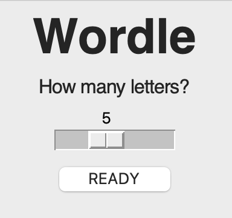
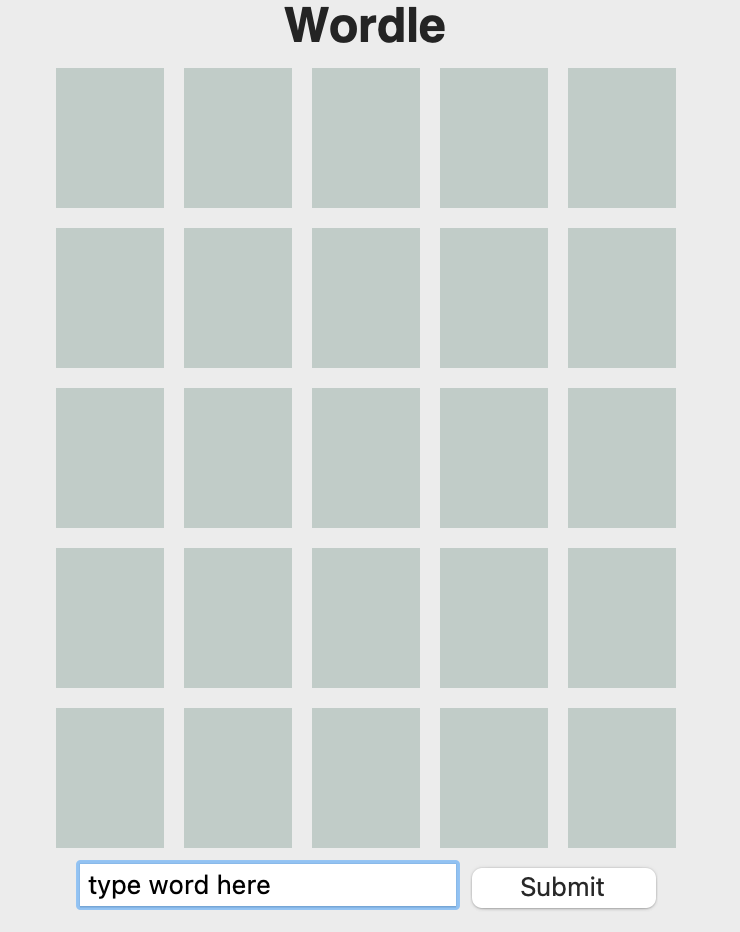
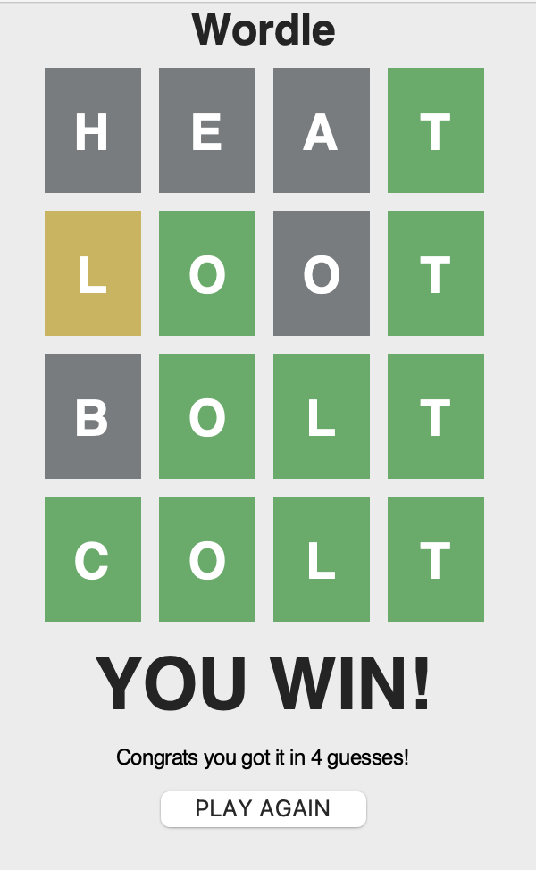

# Wordle Game

## Description

This project is a recreation of New York Times' Worldle game with added settings were the player can choose the number of letters to guess. 
The goal of this project was to have fun creating a game I already enjoyed as well as try out the Tkinter Library in Python. 
This was my first time using Tkinter, and I learned a lot about the widget system and creating a GUI. 
As a bonus, I tried out Openpyxl to generate an excel sheet for the game's word list. 

## Installation

In order for the game to be able to choose the solution word, users must have Openpyxl installed. This can be done by: 


```sh
pip install openpyxl
```

To play the game, install Tkinter as well, then run the App.py file. 
Installing Tkinter can be done through: 

```sh
pip install tk
```

## Usage
Start the game by choosing the number of letters and clicking READY: \
\
 
\
Play by typing guesses into the text box and pressing submit: \
\

\
Keep guessing until the solution is reached or guesses are maxed out: \
\

\


## License
Wordle belongs to New York Times. This is simply a fan remake. Play the original game here: 
[https://www.nytimes.com/games/wordle/index.html](https://www.nytimes.com/games/wordle/index.html)

## Features

If your project has a lot of features, list them here.

## How to Contribute

Not accepting contributions. 

