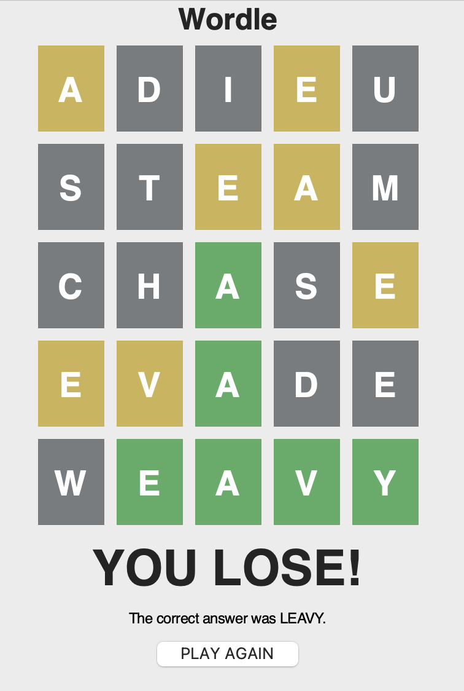

# Wordle Clone Game
By **Clara Hong** (clarashong)

## Description
This project is a recreation of New York Times' "Wordle" with added settings where the player can choose the number of letters to guess.
Play the actual New York Times game here: 
[https://www.nytimes.com/games/wordle/index.html](https://www.nytimes.com/games/wordle/index.html) \
I do not own the game, and this project was just programming practice. 
The goal of this game remake was to have fun recreating a game I already enjoyed, as well as to try out the Tkinter Library in Python. 
This was my first time using Tkinter, and I learned a lot about the widget system and creating a GUI. 
As a bonus, I experimented with Openpyxl to generate an excel sheet for the game's word list. 

## Installation

In order for the game to be able to choose the solution word, users must have Openpyxl installed. This can be done by: 


```sh
pip install openpyxl
```

To play the game, install Tkinter as well, then run the App.py file. 
Installing Tkinter can be done through: 

```sh
pip install tk
```

## Usage
Start the game by choosing the number of letters and clicking READY: \
\
 
\
Play by typing guesses into the text box and pressing submit: \
\

\
Keep guessing until the solution is reached or guesses are maxed out: \
\

\


## License
Wordle belongs to New York Times. This is simply a fan remake.

## How to Contribute

Not accepting contributions. 

